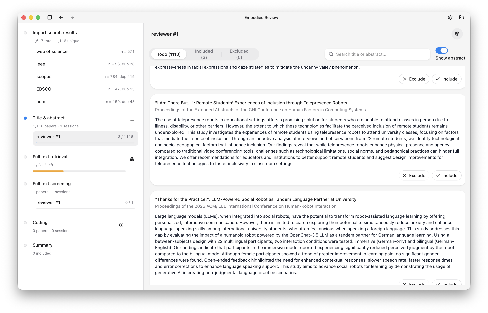

# Panorama Review

Panorama Review is an app for organizing, screening, and reviewing academic papers for review projects.

## Overview

Panorama Review helps research teams manage papers through the review workflow, from screening to coding and conflict resolution.

## Download

Download the latest application build from the GitHub releases page:

https://github.com/panorama-lab/review/releases

## Features

### PRISMA Workflow Support

- Screening sessions
- Coding sessions
- Conflict resolution

### Full-Text Retrieval with LibKey

- Configure your LibKey resolver URL.
- In the "Retrieve full text" stage, click "Download" to fetch the PDF.
- Downloaded PDFs are automatically attached to the corresponding literature record.

## Community

- Report bugs or request features: https://github.com/panorama-lab/review/issues
- Join the Discord server: https://discord.gg/PtgNPuHMFs
